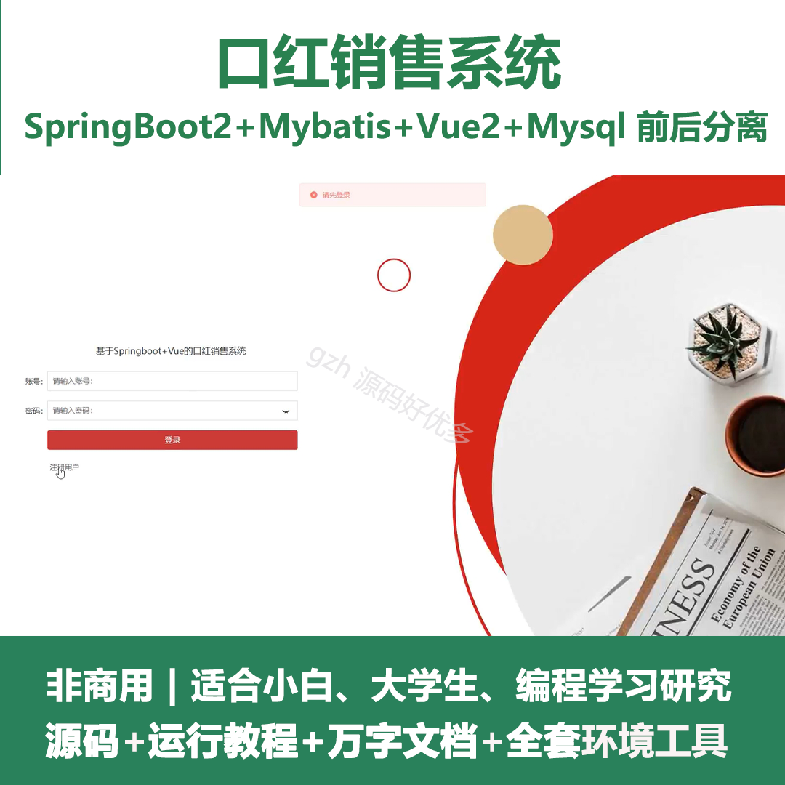
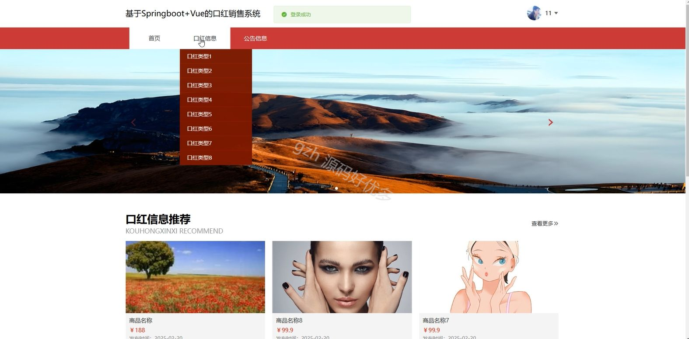
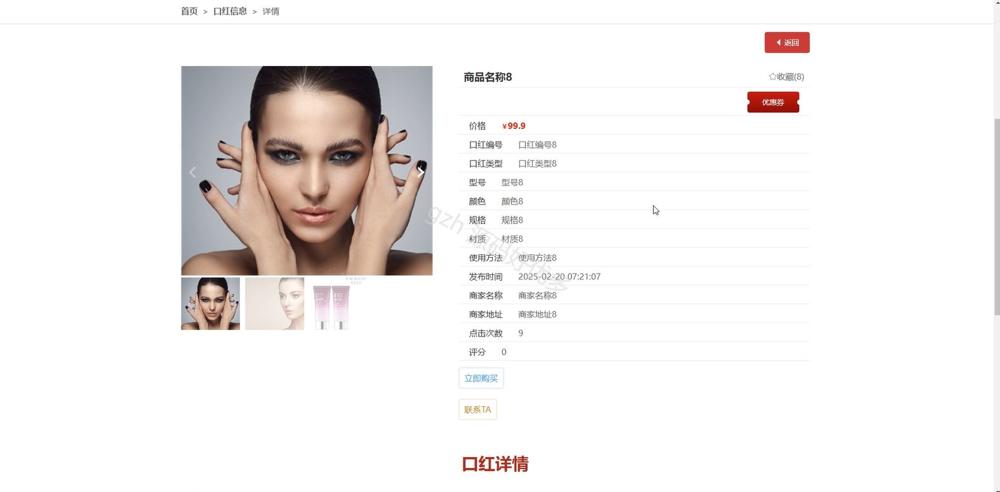
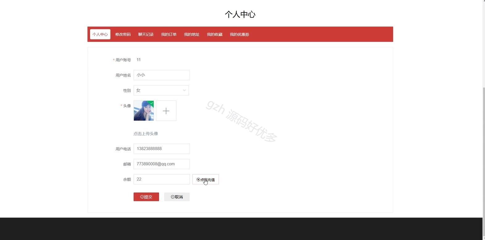
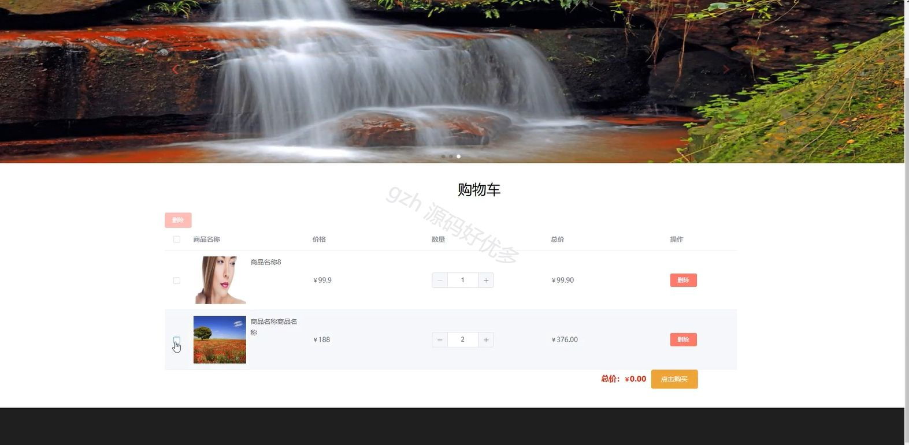
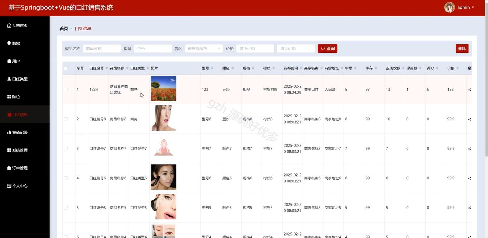
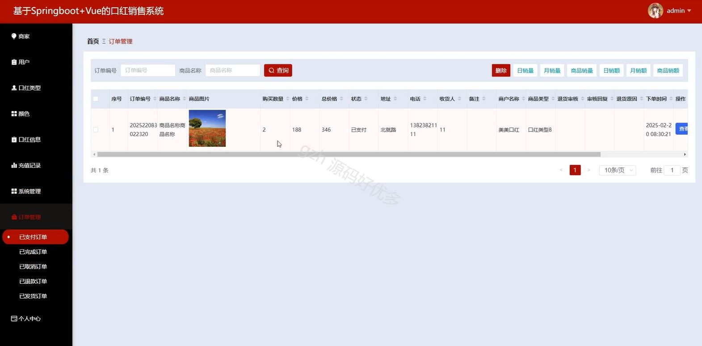
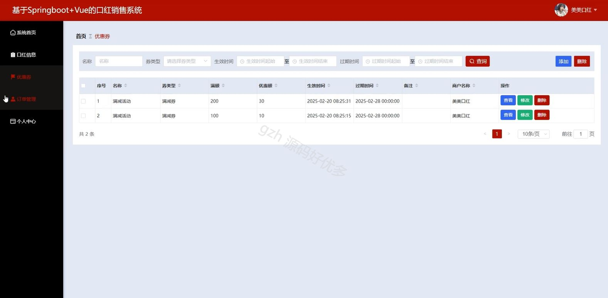
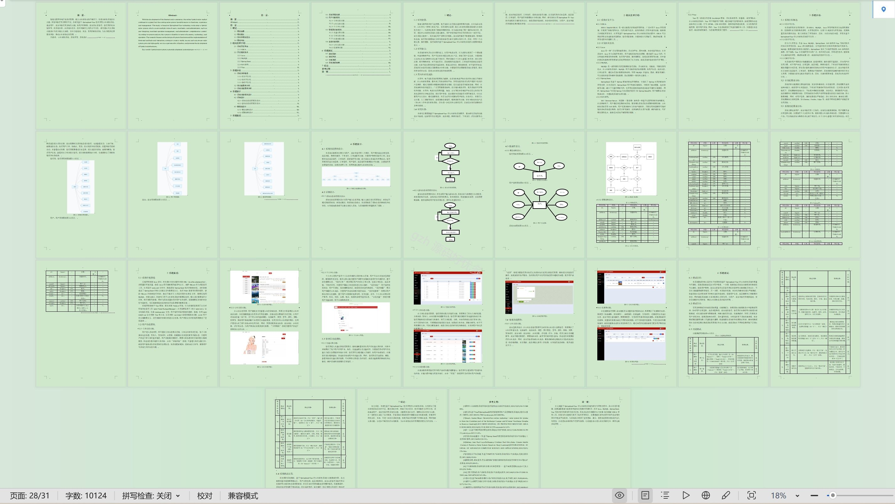

# springbootA206D
springbootA206D口红销售系统
## 查看主页获取源码

### 一、关键词

在线销售、电商系统、订单处理

 

### 二、作品包含

源码+数据库+设计文档万字+全套环境和工具资源+部署教程

 

### 三、项目技术

前端技术：Html、Css、Js、Vue2.0、Element-ui 
后端技术：Java、SpringBoot2.0、MyBatis

  

 

### 四、运行环境（以下版本亲测，其他版本未知，请自测）

开发工具：IDEA/eclipse  + VSCODE

数据库：MySQL5.7（最低要5.7版本）

数据库管理工具：Navicat10以上版本

环境配置软件： JDK1.8 + Maven3.6.3

前端Nodejs：14

浏览器：谷歌浏览器

 

### 五、项目介绍

项目编号：springbootA206D

口红销售系统是管理和优化口红产品从销售、库存到客户服务的全流程，以提升效率和销售额的工具。

角色：管理员、用户、商家

管理员：系统首页、商家、用户、口红类型、颜色、口红信息、充值记录、系统管理、订单管理、个人中心。

用户：首页、口红信息、公告信息、购物车、个人中心 修改密码 聊天记录 我的订单 我的地址 我的收藏 我的优惠券。

商家：系统首页、红包信息、优惠券、订单管理、个人中心。

 

### 六、运行截图

